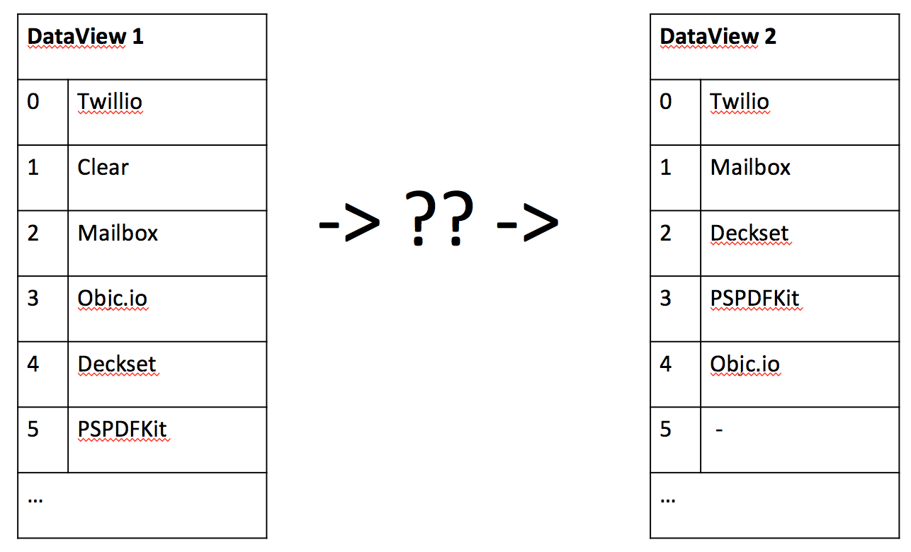
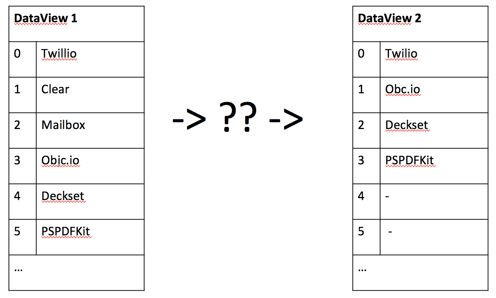

## Ditching CoreData
_side-stage talk given at [UIKonf 2014](http://www.uikonf.com/)_  
Steven Kabbes [@kabb](https://twitter.com/kabb)  
Engineer @ [Mailbox](http://www.mailboxapp.com/) + [Dropbox](https://www.dropbox.com/jobs)  

### About me
* at Mailbox for about 2.5 years
* Worked on Mailbox infra, mostly the core email sync algorithms until [Mailbox launch](http://vimeo.com/54553882)
  - Mapping IMAP to a sane protocol
  - Layering features on top of IMAP (threading, conversation parsing, delta diff, checkpoint imap sync)
* then moved to non-UI mobile (libmailbox)

### Mailbox 2.0
* paving the way for more platforms, making longer term bets to be able to quickly build Mac Desktop, Android & other platforms
* migrate tens of thousands of LOC to C++
  - websockets -> C++
  - NSUserDefaults -> levelDB + [json11](https://github.com/dropbox/json11) + C++
  - **CoreData -> SQLite + C++**

### Rewrite CoreData... seriously?
Its very important to understand why we decided to migrate from CoreData. CoreData _is_ fast enough and CoreData _is_
powerful enough, but we _needed_ android, mac desktop, and we _will_ need windows desktop. The immediate choice in
front of us was to **either rewrite Mailbox in Java or C++**.

### Why _not_?
* SQLite is written in C
  - API is _much_ more difficult than CoreData (but query API is powerful, SQL)
  - you need to build your own abstractions on top
  - OR find a good (and thin!) sqlite wrapper
* C++ is complex / difficult
  - _"C++11 feels like a whole new language"_ -Bjarne Stroustrup, creator of C++
  - [http://www.stroustrup.com/C++11FAQ.html](http://www.stroustrup.com/C++11FAQ.html)
  - need for memory management is essentially eliminated (much like ARC) with [unique_ptr](http://www.cplusplus.com/reference/memory/unique_ptr/),
[shared_ptr](http://www.cplusplus.com/reference/memory/shared_ptr/) and the
[RAII](http://en.wikipedia.org/wiki/Resource_Acquisition_Is_Initialization) pattern
* NDK build system is hard / confusing
  - it is, but we were lucky enough to find the Google's meta-build system, [gyp](https://code.google.com/p/gyp/) which
can generate xcode projects, android makefiles, unix makefiles, and even visual studio projects from a
[JSON description](https://github.com/libmx3/mx3/blob/master/mx3.gyp)
* the Java Native Interface (JNI) is terrible to work with
  - this is a property of Java, not Android.  Google has the ability to fix this specifically for android
  - I believe the community will build tooling to mitigate this

### Can such a small team rewrite CoreData?
That _is not_ what we tried to do, we didn't aim to rewrite CoreData (would be fun though).  We didn't try to even
rewrite just the parts Mailbox uses.  We thought back to our initial goal (ship Mailbox on Android) and we only needed
one thing **persistence and query layer in c++**.

SQLite pretty much already meets this description, but we also needed 
[NSManagedObjectContextObjectsDidChangeNotification](https://developer.apple.com/library/ios/documentation/Cocoa/Reference/CoreDataFramework/Classes/NSManagedObjectContext_Class/NSManagedObjectContext.html#//apple_ref/c/data/NSManagedObjectContextObjectsDidChangeNotification)
to maintain the delightful animation and fast processing that has been defining for the Mailbox product. Armed with SQLite
we only needed to work on delta changes, our c++ ObjectsChangedNotification

### concepts
3 major concepts

* `Query`: (roughly NSFetchRequest), running query over and over produces different DataViews
* `DataView`: a sorted list of _stuff_. roughly a result set of a SQL query
* `ChangeSet`: what was added, what was deleted, what was moved, what was updated

### how concepts relate
1. `Query` yields `DataView₁`
2. (time passes, something changes)
3. `Query` yields `DataView₂`
4. Diff(`DataView₁`, `DataView₂`) yields `ChangeSet₁₂`
5. `DataView₁` + `ChangeSet₁₂` yields `DataView₂`

Steps 1 and 3 are essentialy just running a SQLite query. Step 5 is already defined by UITableView & NSTableView
(_beginUpdates_, ..., _endUpdates_). So we need to design an algorithm for 4.

### an aside on DB replication
An interesting way to think about this problem is to imagine that `UITableView` is a replica of your data in SQLite
that you want to remain consistent.  Also, just like a database system we want to be able to do this as efficiently
as possible.  Deriving this ChangeSet enables efficient updates (with animation) to `UITableView`.

### diffing 2 DataView's
What is the minimal amount of changes between these 2 DataView's?

1. Delete Clear
2. Move Objc.io

What about this one?

1. Delete Clear
2. Delete Mailbox

Think about this, how would you express this to UITableView?

1. `[Delete(1), Delete(1)]`
2. `[Delete(1), Delete(2)]`

Turns out, NSTableView wants option 1, UITableView wants option 2. NSTableView wants a consistent view of data after 
each update.  We struggled with this problem for a bit, the easy solution was to just write 2 separate sets of code
for each, but that defeats the purpose of a shared library :(

However, if you apply the updates _in the correct order_, you don't need to do index shuffling...

`[Delete(2), Delete(1)]` works for both!

1. Deletes in descending order
2. Inserts in ascending order

### accidental nice things
After we built this, and looked back on the solution - we ended up accidentally accomplishing things we didn't mean to.
* data locality
* perf improvements (not at first though, we stupidly ported over some optimizations that made CoreData faster, but SQLite slower)
* ability to trivially move from sqlite (we separated ChangeSet calculation from Query completely)

### questions? file an issue!
